# SCUDEM 2023 MCM: Dog Cannot Catch


This project contains a small physics simulation of a dog trying to catch a thrown object (ball,
sausage, pizza, taco, steak, fry) as a part of the solution for SCUDEM 20203 MCM Problem C: Dog Cannot Catch.
A throw is generated with some aiming error, the object flies under gravity and air drag, and the dog reacts, runs,
jumps, and snaps its jaw shut to intercept it.

Two dogs are modelled with the same code but different parameters:

* **Optimal**: an idealized dog with fast reactions and no mistiming (~92% catch rate).
* **Fitz**: real dog from the problem: slower, later reactions, and prone to jump/jaw mistiming (~21% catch rate).

Full task details are available here under "Problem C" section: <https://qubeshub.org/community/groups/simiode/File:/uploads/docs/SCUDEMVIII2023/SCUDEM_VIII_2023_All_Three_Problems.pdf>

The full write-up (derivations, calibration story, results discussion,
and figures in print quality) lives in **[`report.pdf`](report.pdf)**.

---

## Project layout

```text
.
├── constants.py             # World/physics/throw/FPS constants
├── objects.py               # Throwable objects + drag-term derivation
├── physics.py               # Ball trajectory & dog run/jump kinematics
├── interception.py          # Interception planner
├── dog_profile.py           # DogProfile dataclass (Optimal defaults)
├── visualization.py         # Matplotlib MP4 animation
├── main.ipynb               # Driver: profiles (OPTIMAL, FITZ),
│                            #   simulate(), simulate_silent(), run_batch()
├── scripts/                 # Helpers: figures, frame extraction, screenshots
├── videos/                  # MP4 animations of representative attempts
├── assets/figures/          # Diagnostic figures (PDF + PNG) used in report.pdf
├── assets/images/yt_errors/ # YouTube screenshots used in the report
├── simulation_frames/       # (Generated) per-attempt frame dumps
├── report.pdf               # Full project report
├── SCUDEM 2023_ Dog Cannot Catch.md   # Original problem statement
└── pyproject.toml           # uv / pip project metadata
```

---

## Quickstart

The project uses [uv](https://docs.astral.sh/uv/) for environment
management; any Python ≥ 3.13 with NumPy and Matplotlib will also work.

```bash
# With uv (recommended)
uv sync

# Or with pip
pip install -e .
```

Open the notebook:

```bash
uv run jupyter notebook main.ipynb
```

The notebook exposes three driver functions:

```python
# A single attempt rendered as an MP4 into videos/
simulate(dog=FITZ)                       # random seed, random object
simulate(seed=37121210, dog=FITZ)        # reproducible

# A single attempt without animation (returns (success, seed, object))
simulate_silent(seed=37121210, dog=FITZ)

# 1000 randomized attempts; prints overall + per-object stats.
# batch_seed makes the whole batch reproducible: two calls with the same
# batch_seed run the *exact same* set of throws, which is how the Optimal
# and Fitz numbers below were obtained on identical inputs.
run_batch(1000, dog=FITZ,    batch_seed=0)
run_batch(1000, dog=OPTIMAL, batch_seed=0)
```

---

## Results

Per-object catch rates from `run_batch(1000, batch_seed=0)`:

| Object | Optimal catch rate | Fitz catch rate |
| --- | --- | --- |
| Ball     | 92.7% | 25.1% |
| Sausage  | 92.7% | 21.2% |
| Pizza    | 88.8% | 18.8% |
| Taco     | 93.2% | 24.7% |
| Steak    | 88.7% | 19.5% |
| Fry      | 95.4% | 14.4% |
| **Overall** | **91.9%** | **20.8%** |

<p>
  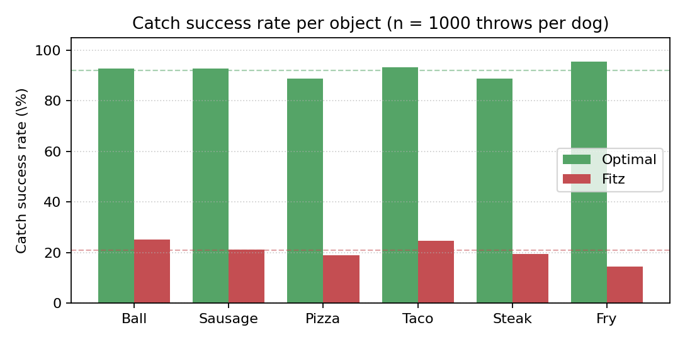
</p>

The ordering is the same for both dogs (high-drag fry hardest, ball
easiest), and the gap between the two profiles is roughly uniform —
supporting the claim that the per-dog parameters dominate the catch
difficulty, not the object properties.

### A successful Optimal attempt

Three frames from the same run (the same animation used in the report):

<p>
  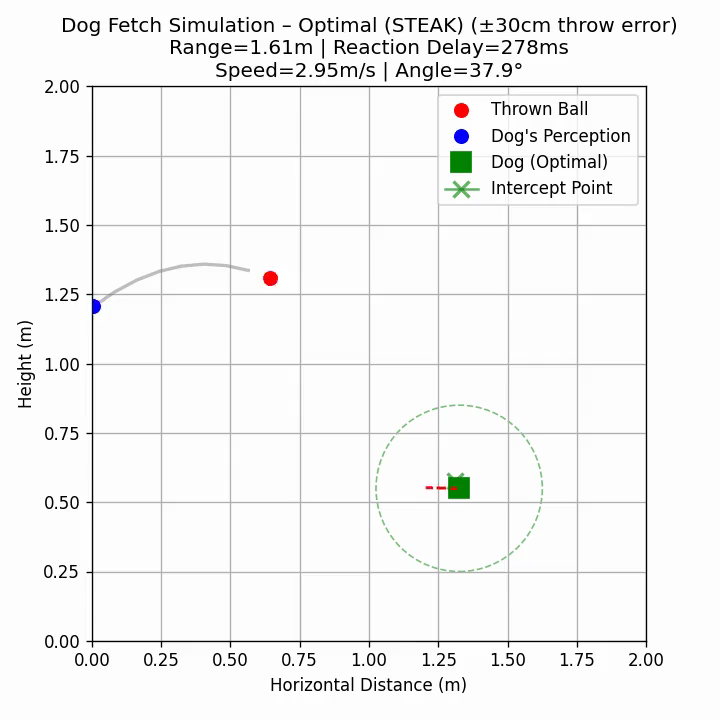
  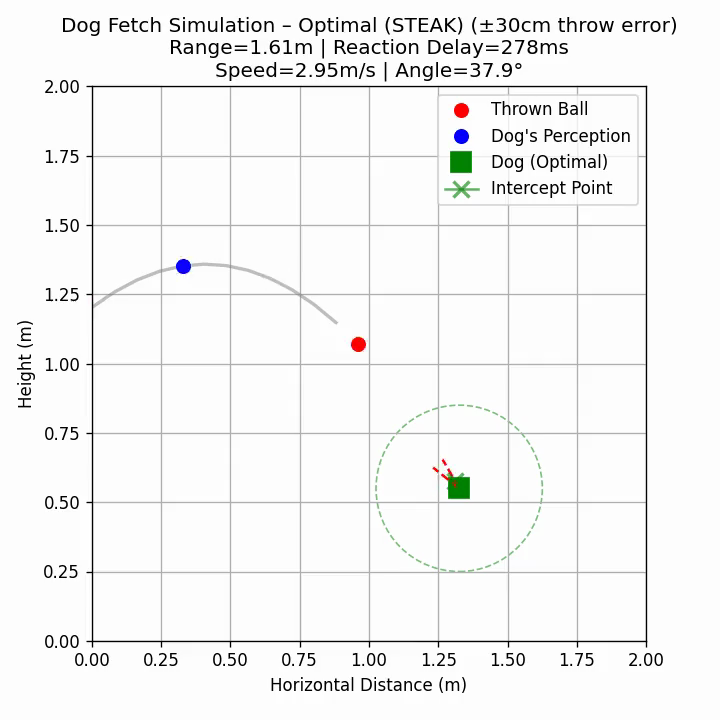
  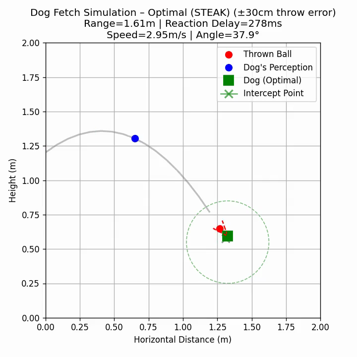
</p>

Left: just after reaction - dog starts moving, ball already mid-flight.
Middle: arrival - dog under the intercept point, jaw opening.
Right: catch - ball inside the closing jaw cone.

### A failed Fitz attempt

<p>
  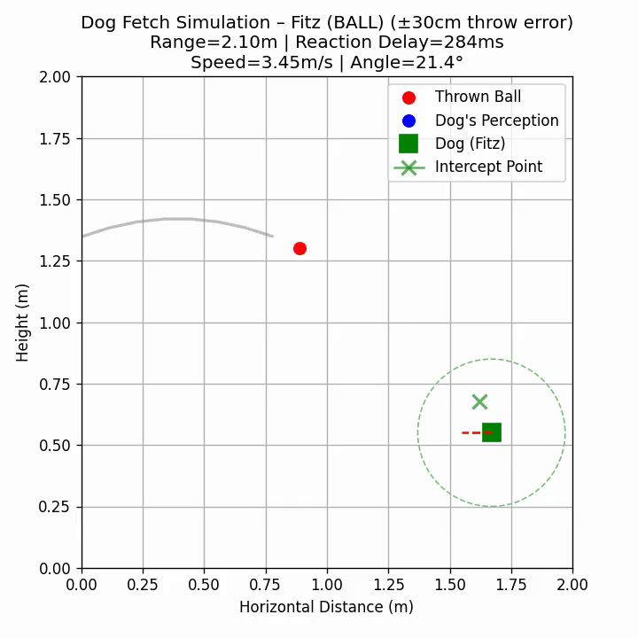
  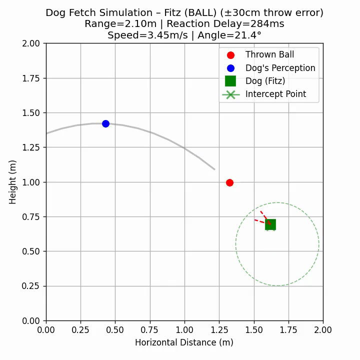
  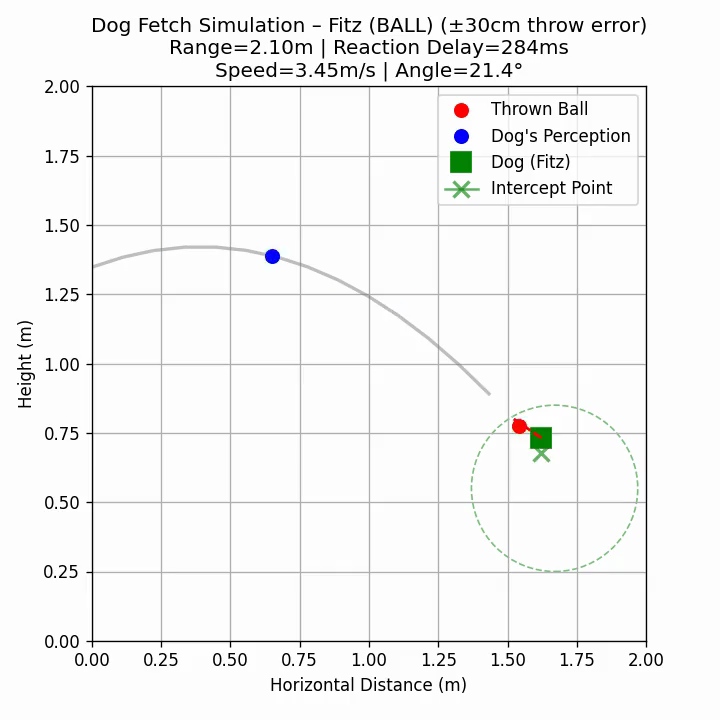
</p>

Notice the blue "dog's perception" marker lagging the true red ball,
the jaw direction off-axis from the actual incoming food, and the dog
arriving with its mouth already shut.

---

## How everything is modelled

The full derivations are in `report.pdf`; this section is just the
one-screen summary. Symbols: positions in metres, times in seconds,
angles in radians, $g = 9.81\ \mathrm{m/s^2}$,
$\rho = 1.225\ \mathrm{kg/m^3}$.

### Drag

Each throwable object is described by mass $m$, frontal area $A$, and
a dimensionless shape drag coefficient $c_d$. Standard quadratic drag
$F_d = \tfrac{1}{2} c_d \rho A v^2$ divided by mass yields a single
per-object **drag term**

$$ k = \frac{c_d \rho A}{2 m}\quad [\mathrm{m}^{-1}], $$

so a fry ($k \approx 0.17$) decelerates roughly an order of magnitude
faster than a ball ($k \approx 0.018$).

<p>
  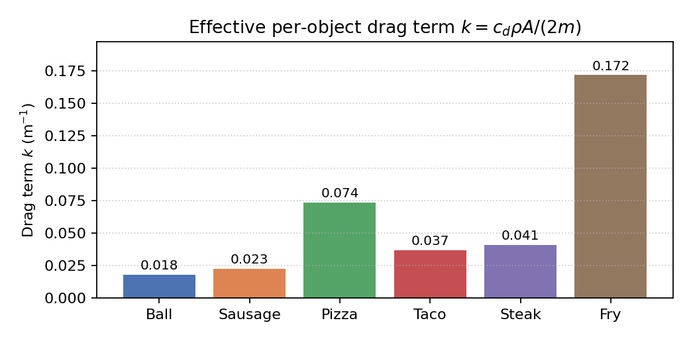
</p>

For the same launch conditions the ball follows an almost-parabolic
arc, the fry decelerates noticeably and lands shorter and steeper:

<p>
  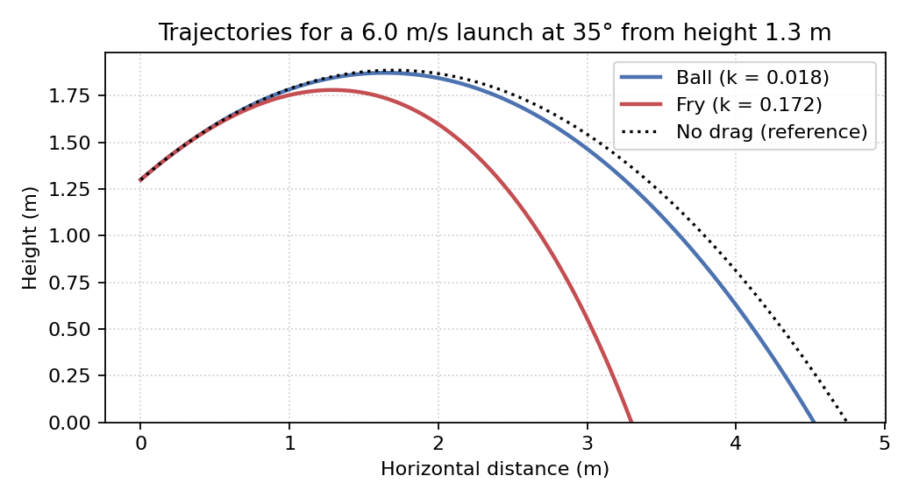
</p>

### Ball trajectory

The object is a point mass under gravity plus quadratic drag opposing
its velocity. With $v = \sqrt{v_x^2 + v_y^2}$,

$$ a_x = -k v_x v, \qquad a_y = -g - k v_y v. $$

There is no closed form, so the trajectory is integrated with
**semi-implicit (symplectic) Euler** at $\Delta t = 0.01$ s. Position
at any time is recovered by linear interpolation between samples.

### Aiming and launch speed

The thrower aims at the dog's head but with a random offset sampled
uniformly over a disc of radius $R = 0.3$ m (using $r = R\sqrt{u}$ so
the offset is uniform over the *area*). The launch speed is solved
analytically from the **drag-free** trajectory equation, so when drag
is then applied during the actual flight the object lands a bit short
of the aim — a deliberate, realistic imperfection.

### Dog running kinematics

A burst-acceleration law that tapers as speed approaches
$v_{\max}$ — $\dot v = a_0(1 - (v/v_{\max})^2)$, integrates to a
$\tanh$ speed profile and a $\ln\cosh$ distance profile:

$$
v(t) = v_{\max} \tanh\!\left(\frac{a_0 t}{v_{\max}}\right),
\qquad
d(t) = \frac{v_{\max}^2}{a_0}\ln\cosh\!\left(\frac{a_0 t}{v_{\max}}\right).
$$

The inverse $d^{-1}(\cdot)$, used by the planner to ask "how long
will it take to cover this distance?", is computed by bisection.

<p>
  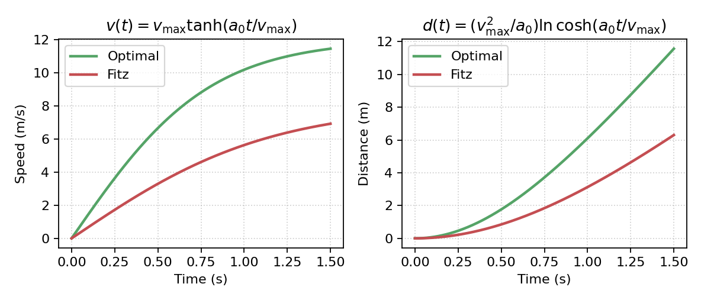
</p>

### Jump kinematics

To lift the head from the rest height $\mathrm{GOAL\_Y} = 0.55$ m by
$\Delta h$, the dog uses a vertical ballistic launch with take-off
velocity $v_{y,\text{jump}} = \sqrt{2 g \Delta h}$ and apex time
$t_{\mathrm{apex}} = v_{y,\text{jump}} / g$.

### Predicting the intercept point

When the dog first reacts, it scans the remaining flight and, for each
candidate time $t_c$, computes the time the ball will need to reach
$(b_x, b_y)$ (= $t_c - t_{\mathrm{now}}$) versus the time the dog
needs to get there:

$$ t_{\mathrm{need}} = \underbrace{d^{-1}(|g_x - b_x|)}_{\text{run}} + \underbrace{\sqrt{2 \Delta h / g}}_{\text{jump}}. $$

It then picks, in order: the **reachable** point with the smallest
timing slack $|t_{\mathrm{avail}} - t_{\mathrm{need}}|$; failing that,
the **least-unreachable** one; failing that, a pure-running
**fallback** at the highest reachable ball point. Planning happens
*once*, at the moment of reaction — there is no replanning.

### Jaw aiming, opening, and snapping shut

The jaw should meet the ball head-on, so its target direction
$\phi_{\mathrm{aim}}$ points back along the incoming ball velocity
(estimated by finite difference at the intercept time), plus a fixed
bite offset and a per-attempt aim error
$\epsilon_{\mathrm{jaw}}$. The jaw rotates from rest toward
$\phi_{\mathrm{aim}}$ at a finite rate $\omega$, opens
**linearly** from $0$ to $\theta_{\mathrm{open}}$ between reaction
and intercept, then snaps shut linearly over $T_c = 0.05$ s starting
at the trigger time $t^* + \epsilon_{\mathrm{close}}$.

### Catch detection

Around the intercept time the simulation samples 20 instants. A catch
is declared if at any of them the ball is both:

1. within reach: $\lVert \mathbf{r} \rVert \le L$ (jaw length / catch radius), and
2. inside the open jaw cone: $\lvert\angle(\mathbf{r}, \phi)\rvert \le \theta(t)$.

---

## Dog parameters

The two profiles share their **geometry / physiology** (taken from
typical adult Golden Retriever values (Fitz is a Golden Retreiver)) and differ
only in their **ability** parameters. The shared geometry:

| Symbol | Meaning | Value |
| --- | --- | --- |
| $\mathrm{GOAL\_Y}$ | head-at-rest height | $0.55$ m |
| $L$ | jaw length / catch radius | $0.12$ m |
| $\theta_{\mathrm{open}}$ | max jaw opening half-angle | $0.4$ rad (~23°) |
| $\omega$ | jaw rotation rate | $7$ rad/s |
| $\phi_{\mathrm{offset}}$ | jaw aim offset | $0.2$ rad |
| $T_c$ | jaw close duration | $0.05$ s |

### Optimal — idealized aspirational dog

The launch height $h_0 \sim \mathcal U(1.2, 1.4)$ m and launch angle
$\alpha \sim \mathcal U(20^\circ, 45^\circ)$ are also randomized.

### Solving for the launch speed

Given the angle $\alpha$ and the desired target point
$(x_\text{target}, y_\text{target})$, we need the launch speed $v_0$ that makes a
**drag-free** projectile pass through that point. Starting from the standard
trajectory equation

$$
y = h_0 + x\tan\alpha - \frac{g\,x^2}{2\,v_0^2\cos^2\alpha},
$$

and solving for $v_0$ at $x = x_\text{target}$, $y = y_\text{target}$:

$$
v_0 = \sqrt{\dfrac{g\,x_\text{target}^2}
{2\cos^2\alpha\,\bigl(h_0 - y_\text{target} + x_\text{target}\tan\alpha\bigr)}} .
$$

If the denominator is $\le 0$ the geometry is unreachable and the throw is
rejected. The launch velocity components are then
$v_x = v_0\cos\alpha$ and $v_y = v_0\sin\alpha$.

Note: $v_0$ is solved **without** drag (closed form), but the actual flight is
then integrated **with** drag, so the object lands a bit short of the aim point, which makes for
a deliberate, realistic imperfection.

*Code:* `simulation` cell → `_setup_throw()`.

---

## 4. Dog running kinematics

A dog does not move at constant speed; it accelerates from rest toward a top
speed. The model uses a smooth burst-acceleration law in which acceleration
tapers as speed approaches the maximum $v_{\max}$, equivalent to
$\dot v = a_0\bigl(1 - (v/v_{\max})^2\bigr)$. This integrates to a hyperbolic
tangent speed profile:

$$
v(t) = v_{\max} \tanh\!\left(\frac{a_0\, t}{v_{\max}}\right).
$$

Integrating once more gives the distance travelled from a standing start:

$$
d(t) = \frac{v_{\max}^2}{a_0}\,
\ln\!\cosh\!\left(\frac{a_0\, t}{v_{\max}}\right).
$$

Here $a_0$ is the initial burst acceleration and $v_{\max}$ the top speed (Optimal:
$a_0 = 15,\ v_{\max} = 12$; Fitz: $a_0 = 7,\ v_{\max} = 8$).

### Inverting distance → time

To plan an interception we also need the time to cover a given distance $d$,
i.e. invert $d(t)$. Since $d(t)$ is monotonically increasing, it is inverted by
**bisection** (50 iterations) on the interval
$[0,\ d/v_{\max} + v_{\max}/a_0]$ (the upper bound is the cruise time plus a slack
term covering the acceleration phase).

*Code:* `physics.py → dog_velocity()`, `dog_distance()`, `dog_time_for_distance()`.

---

## 5. Jump kinematics

To catch a ball at height $y_t$ above the ground, the dog must lift its head from
its rest height $\mathrm{GOAL\_Y}$ by

$$
\Delta h = \max(0,\ y_t - \mathrm{GOAL\_Y}).
$$

Treating the jump as vertical projectile motion, the take-off vertical velocity
needed to reach apex at $\Delta h$ (where $v_y = 0$) comes from
$v_y^2 = 2 g\,\Delta h$:

$$
v_{y,\text{jump}} = \sqrt{2 g\,\Delta h},
\qquad
t_\text{apex} = \frac{v_{y,\text{jump}}}{g},
\qquad
t_\text{air} = \sqrt{\frac{2\,\Delta h}{g}} .
$$

While airborne the head follows a ballistic arc, integrated per frame:

$$
y \leftarrow y + v_y\,\Delta t - \tfrac12 g\,\Delta t^2,
\qquad
v_y \leftarrow v_y - g\,\Delta t .
$$

*Code:* `dog motion` cell → `_jump_kinematics()`, `_advance_dog()`;
`interception.py → _jump_time()`.

---

## 6. Interception planning

When the dog first reacts, it predicts the entire ball path and chooses a single
target point to attack. For each candidate time $t_c$ along the remaining flight
it reads the ball position $(b_x, b_y)$ and computes:

* **time available** until the ball is there: $\;t_\text{avail} = t_c - t_\text{now}$
* **horizontal distance** to cover: $\;d = \lvert g_x - b_x\rvert$
* **total time the dog needs**: run time + jump time,

$$
t_\text{need} = \underbrace{d^{-1}\!\!\;(d)}_{\text{run}} \; + \;
\underbrace{\sqrt{2\,\Delta h / g}}_{\text{jump}} .
$$

The planner prefers a point that is **in front of the dog** ($b_x < g_x$) and
**above head height** ($b_y > \mathrm{GOAL\_Y}$). Among those it picks by:

1. **Reachable** ($t_\text{need} \le t_\text{avail}$): minimize the timing error
   $\lvert t_\text{avail} - t_\text{need}\rvert$ (i.e. the catch that needs the
   least waiting/rushing).
2. If none are reachable, the **least-unreachable** one: minimize the deficit
   $t_\text{need} - t_\text{avail}$.
3. Otherwise a pure-running **fallback**: any point the dog can reach by distance
   alone ($d(t_\text{avail}) \ge d$), choosing the highest such ball point.

*Code:* `interception.py → compute_interception()`.

### Departure timing

Once the target time $t^*$ and point are known, the dog should leave so it
arrives exactly on time, not immediately. With run time $t_\text{run}$ and jump
time $t_\text{jump}$ to the target, the depart time is

$$
t_\text{depart} = \max\bigl(t_\text{react},\ t^* - t_\text{run} - t_\text{jump}\bigr).
$$

---

## 7. Dog motion state machine

Each frame the dog is in one of three states, handled in `_advance_dog()`:

1. **Airborne** ($y > 0.01$): follow the ballistic arc, clamping $x$ at the
   target and landing when $y \le 0$.
2. **Running** ($\lvert\Delta x\rvert > 0.02$): advance horizontally at the
   current run speed $v(t_\text{run})$, signed toward the target. Jump when
   the **time remaining** drops to the apex time (plus mistiming):

$$
t^* - t_\text{now} \;\le\; t_\text{apex} + \epsilon_\text{jump}.
$$

3. **In position**: wait until the same jump condition triggers, then launch.

Positions are stored as $(x,\ \text{height above rest})$ per frame; the head is
drawn at $y_\text{head} = y + \mathrm{GOAL\_Y}$.

*Code:* `dog motion` cell → `_advance_dog()`, `simulate_dog_motion()`.

---

## 8. Jaw aiming, rotation and closing

### Aim direction

The jaw should meet the ball head-on. Using the ball's velocity at the intercept
time (estimated by finite difference, $\mathbf v_b \approx [\mathbf b(t^*+\delta) - \mathbf b(t^*)]/\delta$ ),
the desired jaw direction points *back along* the incoming ball:

$$
\phi_\text{aim} = \mathrm{atan2}(-v_{b,y},\,-v_{b,x})
                 + \phi_\text{offset} + \epsilon_\text{jaw},
$$

where $\phi_\text{offset}$ is a fixed bite offset and $\epsilon_\text{jaw}$ a
random aiming error. The target is stored as the unit vector
$(\cos\phi_\text{aim}, \sin\phi_\text{aim})$.

*Code:* `dog motion` cell → `compute_jaw_target()`.

### Rotation toward the aim

The jaw starts pointing left ($\phi_0 = \pi$) and rotates toward $\phi_\text{aim}$
at a finite angular rate $\omega$. With elapsed time $\tau$ since the dog saw the
ball, and the shortest signed angular difference

$$
\Delta\phi = \bigl((\phi_\text{aim} - \phi_0 + \pi) \bmod 2\pi\bigr) - \pi,
$$

the current jaw angle is the wrapped, rate-limited rotation

$$
\phi(\tau) = \phi_0 + \mathrm{sign}(\Delta\phi)\,
\min\bigl(\lvert\Delta\phi\rvert,\ \omega\,\tau\bigr).
$$

*Code:* `jaw helpers` cell → `rotated_jaw_angle()`.

### Opening and snapping shut

The mouth opens gradually as the dog approaches the intercept, reaching its full
half-angle $\theta_\text{open}$ at the catch, then snaps shut over a short
duration $T_c$. Let $t_\text{trig}$ be the closing trigger time. The opening
half-angle is

$$
\theta(t) =
\begin{cases}
\theta_{\mathrm{open}}\,\dfrac{t - t_{\mathrm{react}}}{t^* - t_{\mathrm{react}}}, & t < t_{\mathrm{trig}} \; (\text{opening}) \\
\theta_{\mathrm{open}}\left(1 - \dfrac{t - t_{\mathrm{trig}}}{T_c}\right), & t_{\mathrm{trig}} \le t < t_{\mathrm{trig}} + T_c \; (\text{closing}) \\
0, & \text{otherwise (shut)}
\end{cases}
$$

*Code:* `jaw helpers` cell → `jaw_open_closing()`; `visualization.py → _jaw_open_amount()`.

---

## 9. Per-dog error and mistiming

What separates Optimal from Fitz is randomized error, sampled uniformly per
attempt from per-dog ranges:

| Symbol | Meaning | Optimal | Fitz |
| --- | --- | --- | --- |
| reaction delay | $t_\text{react} \sim \mathcal U(\cdot)$ ms | $[150, 300]$ | $[250, 350]$ |
| $\epsilon_\text{jump}$ | jump mistiming (s) | $0$ | $[-0.25, 0.25]$ |
| $\epsilon_\text{jaw}$ | jaw aim error (rad) | $0$ | $[-0.4, 0.4]$ |
| jaw-close mistime | trigger offset (s) | $0$ | $[-0.15, 0]$ |

A positive $\epsilon_\text{jump}$ makes the dog jump late; a non-zero
$\epsilon_\text{jaw}$ rotates the bite off the true incoming direction; a
negative close-mistime snaps the jaw early.

The dog's **perception** is also delayed: it only "sees" the ball at its position
$t_\text{react}$ seconds in the past, which is why the blue perception marker
lags the red ball in the animation.

*Code:* `DogProfile` (`dog_profile.py`); sampled in `_setup_throw()`.

---

## 10. Catch detection

After simulating motion, success is decided geometrically. Around the intercept
time the code samples 20 instants $t \in [t^* - 0.05,\ t^* + 0.05]$. At each it
computes the vector from the dog's head to the ball,
$\mathbf r = \mathbf b - \mathbf{head}$, and declares a catch if **both**:

1. The ball is within reach (jaw length / catch radius $L$):

$$
\lVert \mathbf r \rVert \le L .
$$

2. The ball lies inside the open jaw cone: the angle between $\mathbf r$ and the
   current jaw direction $\phi(t)$ is within the current opening (plus a small
   tolerance):

$$
\bigl\lvert\mathrm{wrap}(\mathrm{atan2}(r_y, r_x) - \phi(t))\bigr\rvert
\;\le\; \theta(t) + 0.01,
$$

where $\mathrm{wrap}$ maps an angle to $(-\pi, \pi]$ via
$((\cdot + \pi) \bmod 2\pi) - \pi$, and $\theta(t)$ is the closing-jaw half-angle. 
If any sampled instant satisfies both, the attempt is a success.

*Code:* `jaw helpers` cell → `check_catch_success()`.

---

## 11. Timeline & animation

The simulation runs on a fixed frame grid. The total duration is the flight time
plus the reaction delay plus a 0.3 s tail, sampled at $\mathrm{FPS} = 30$:

$$
T = t_{\mathrm{flight}} + t_{\mathrm{react}} + 0.3,
\qquad
N = \max(2,\ \lfloor T \cdot \mathrm{FPS} \rfloor),
\qquad
t = \mathrm{linspace}(0, T, N).
$$

The animation shows the **true** ball (red), the dog's time-delayed
**perception** (blue, shifted by $t_\text{react}$), the dog (green), its heading
arrow, and the two jaw lines. Each frame is $1000/\mathrm{FPS} \approx 33.3$ ms.

*Code:* `simulation` cell → `_build_timeline()`, `simulate()`;
`visualization.py → plot()`.

---

## Module map

| File | Contents |
| --- | --- |
| Reaction $t_{\mathrm{react}}$ | $\mathcal U(150, 300)$ ms |
| Top speed $v_{\max}$ | $12.0$ m/s |
| Burst acceleration $a_0$ | $15.0$ m/s² |
| Jaw open speed multiplier | $10.0$ |
| Jump mistiming $\epsilon_{\mathrm{jump}}$ | $0$ |
| Jaw aim error $\epsilon_{\mathrm{jaw}}$ | $0$ |
| Jaw close mistiming $\epsilon_{\mathrm{close}}$ | $0$ |

### Fitz — calibrated against the YouTube video

| Parameter | Value | Why |
| --- | --- | --- |
| Reaction $t_{\mathrm{react}}$ | $\mathcal U(250, 350)$ ms | slow to react |
| Top speed $v_{\max}$ | $8.0$ m/s | short lunges, not full sprint |
| Burst acceleration $a_0$ | $7.0$ m/s² | gradual acceleration |
| Jaw open speed multiplier | $7.0$ | slower jaw opening |
| Jump mistiming $\epsilon_{\mathrm{jump}}$ | $\mathcal U(-0.25, 0.25)$ s | jumps too early or too late |
| Jaw aim error $\epsilon_{\mathrm{jaw}}$ | $\mathcal U(-0.4, 0.4)$ rad | mouth pointed off-axis |
| Jaw close mistiming $\epsilon_{\mathrm{close}}$ | $\mathcal U(-0.15, 0)$ s | closes early, never late |

Each of these came from frame-by-frame inspection of the source clip:

| Mistimed jaw closure | Misaimed head |
| :---: | :---: |
| 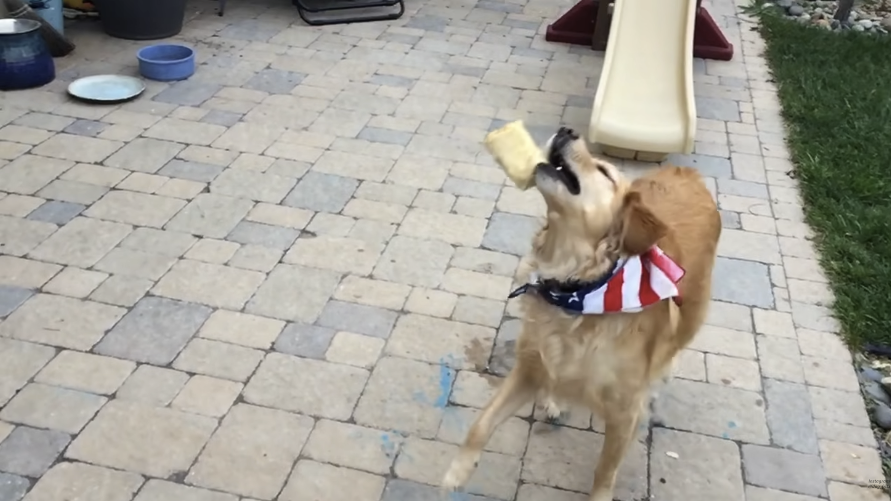 | 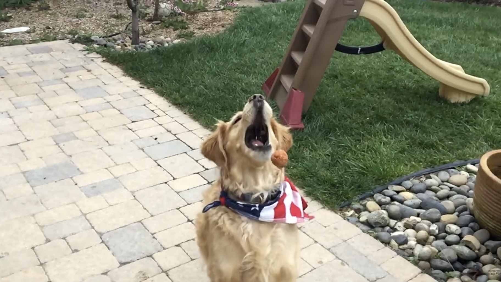 |

| Mistimed jaw closure (second example) | Short-distance throw |
| :---: | :---: |
| 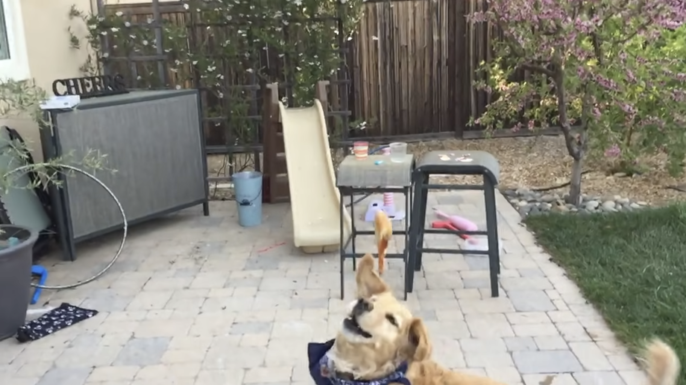 | 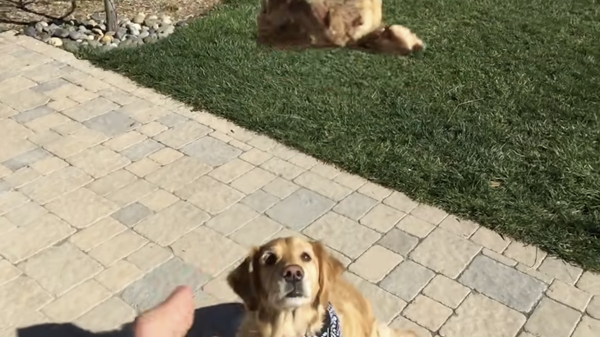 |

*All screenshots are taken from the referenced YouTube video: [link](https://www.youtube.com/watch?v=6w2UxDdhZPk).*

---

## Visual conventions

The MP4 animations in `videos/` and the simulation-frame PNGs above
use a consistent colour scheme:

| Marker | Meaning |
| --- | --- |
| 🔴 Red dot | True ball position (ground truth). |
| 🔵 Blue dot | The dog's *perceived* ball position: same ball, but shifted by the dog's reaction delay. The blue marker visibly lags the red one. |
| 🟩 Green square | Dog body. The short green arrow shows its planned motion direction. |
| Green ✗ inside a dashed circle | The planner's chosen intercept point; the circle is the thrower's aim-error disc. |
| Red dashed segments | Jaw lines (upper and lower), opening as the dog approaches the catch and snapping shut on the closure schedule. |

File names follow the pattern `videos/<profile>_<object>_<seed>.mp4`,
where `<profile>` is `optimal` or `fitz`, `<object>` is one of `ball`,
`sausage`, `pizza`, `taco`, `steak`, `fry`, and `<seed>` is the integer
RNG seed used. Any attempt can be replayed deterministically via
`simulate(seed=...)`.

---

## Modelling scope (deliberate restrictions)

The simulation is intentionally:

* **2D.** A single vertical plane containing thrower and dog.
* **Rigid point-mass objects.** No item rotation, no Magnus/lift, no
  in-flight breakup, so fragile foods such as tacos never fall apart
  mid-air in the model, even though they often do in the source video.
* **Point-like dog with a stick-figure jaw.** No body, legs, or sideways
  twisting; the mouth is a fixed-half-angle cone.
* **Single-shot interception planner.** The dog commits to a target the
  moment it finishes reacting and never replans.
* **No behavioural modelling.** No fear, preferences, motivation,
  fatigue, or learning between attempts.

These restrictions are the main remaining gap between the model and
reality; each is mapped to a concrete extension in the report's
"Natural extensions" section.

---

## Authors

19M081MMS *Mathematical Modeling and Simulations*,
Palace of Science, Center for Applied Mathematics.

- [Mihailo Radović](https://github.com/mradovic38)
- [Boško Zlatanović](https://github.com/bole6)
- [Filip Marčić](https://github.com/fmr538)

Mentor: Prof. Dr. Nataša Ćirović.

Source code: <https://github.com/mradovic38/scudem-2023-mcm-dog>.
